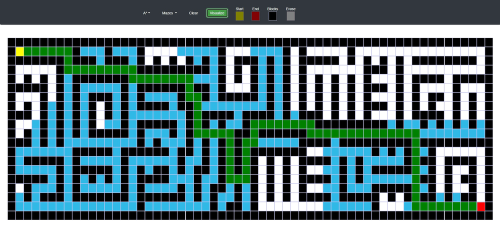

# Visualize Searching Algorithms

### Table of Contents

- [Description](#description)
- [How To Use](#how-to-use)
- [Author Info](#author-info)

---

## Description

This software allows users to visualize different types of searching algorithms utilizing a well designed and easy to use user interface. Its purpose is to demonstrate the effectiveness, cost, and decision making of each algorithm.

#### Technologies

- JavaScript
- HTML5
- CSS

[Back To The Top](#Visualize-Searching-Algorithms)

---

## How To Use

Start by selecting an algorithm you would like to visualize. You have the option of selecting a pre-built maze or filling the grid with black walls yourself. If you want to delete a wall, click on the white button and erase it. Next drag the yellow and red box onto the grid which represents the starting and ending point, respectively. Finally, click Visualize.

[Back To The Top](#Visualize-Searching-Algorithms)

---

## Author Info

- Linkedin - [Mahmoud Agag](https://www.linkedin.com/in/mahmoud-agag-4aba21203/)

[Back To The Top](#Visualize-Searching-Algorithms)